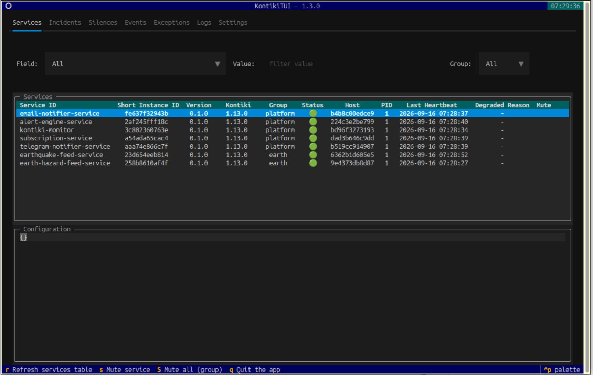

> **Part of the Kontiki suite** — Python runtime, registry, terminal UI, and
> fleet monitoring for distributed services.
>
> Full suite overview → https://kontiki-org.github.io/
>
> Ops demo → [kontiki-monitor Quickstart](https://github.com/kontiki-org/kontiki-monitor#quickstart--demo-app--telegram).

---
## Overview

**Kontiki** is a Python runtime for distributed services on RabbitMQ. You write
`@http`, `@rpc`, `@on_event`, and `@task`. The decorators are the visible API;
most of the leverage sits one layer deeper — identity, routing, delivery, fleet
health, configuration, and testing. You express **intentions in Kontiki terms**,
not broker topology by hand.

This repository is the runtime. The registry,
[KontikiTUI](https://github.com/kontiki-org/kontiki-tui), and
[kontiki-monitor](https://github.com/kontiki-org/kontiki-monitor) share the same
process model.

### Why conventions

Services should differ primarily because of what they do, not because each one
introduces another way of being built and operated.

- An ops job fails months later: find the service in KontikiTUI instead of
  rediscovering its crontab, script, and log file.
- A request failed after crossing several services: follow its `flow_id`
  tree in KontikiTUI instead of correlating timestamps across logs by hand.
- Adding a new service — including a monitor: identity, configuration,
  lifecycle, logging, health, and failure reporting already follow the same
  conventions.

### What Kontiki is not

Kontiki does not aim for maximum infrastructure choice. It is intentionally
Python-first, RabbitMQ-based, and convention-driven. It does not abstract every
broker, become a language-neutral platform, replace orchestration, or reproduce
a tracing, long-term metrics, or IAM product. Those can coexist outside the
common model; they are not the default for everyday needs.

### Runtime

- **One model from dev to production**: merged YAML config, `cli.run`, and the
  same entrypoint decorators in tests (`kontiki.testing` mocks on the bus) and
  in production.
- **Design interactions as messages**: RPC for request/reply; events for async
  work. On `@on_event`, delivery is explicit — **default** (one instance per
  message, competing consumers), **`broadcast=True`** (every instance),
  **`in_session=True`** (one pinned instance via a session).
- **Route by `event_type`**: the event name is the routing contract; deployment
  identity (`kontiki.service_name`, `kontiki.peers`) and environment-specific
  names live in config, not in code.
- **Fleet registry**: heartbeats, degraded state (`degraded_on`), exception
  tracking, live instance ids (`list_instances` / `GET /instances/{service_name}`),
  and orchestrator live probes (`GET /live/{service_name}`). The bus
  runs without a registry; operating the fleet coherently assumes one.
- **Integrated operations**: browse the fleet in
  [**KontikiTUI**](https://github.com/kontiki-org/kontiki-tui), alert from
  registry signals with [**kontiki-monitor**](https://github.com/kontiki-org/kontiki-monitor).

For gotchas, controlled failures (`rpc_error`), and patterns beyond this
overview, see `docs/advanced-features.md`. For a feature-by-feature reference,
see `docs/features.md`.

### Mental model (short)

| Need | Reach for |
|------|-----------|
| Sync API | `@http` / `@rpc` |
| Async reaction | `@on_event` |
| Time-driven work | `@task` |
| One instance handles an event | default `@on_event` (competing consumers) |
| Every instance handles it | `@on_event(..., broadcast=True)` |
| One pinned instance | `@on_event(..., in_session=True)` + `open_session` |
| RPC to one process | `call(..., instance_id=)` / `RpcProxy(..., instance_id=)` |
| Route an event | explicit `event_type` |
| Caller target from deploy config | `RpcProxy(..., peer="…")` / `open_session(peer="…")` → `kontiki.peers` |
| Fleet health | registry + `degraded_on` |
| Cross-service debug | `flow_id` → KontikiTUI Flows (tree, exception, export) |
| Tests on the bus | `kontiki.testing` |
| Gateway into Kontiki from FastAPI, etc. | standalone `Messenger` |

---

## Kontiki suite

Kontiki is not only this runtime. The suite shares the same process model,
registry, and terminal UI:

| Component | Role |
|-----------|------|
| **Kontiki** (this repo) | Service runtime — entrypoints, messaging, registry client, config, testing |
| [**kontiki-tui**](https://github.com/kontiki-org/kontiki-tui) | Terminal UI over the registry and local logs — browse services, flows, and exceptions |
| [**kontiki-monitor**](https://github.com/kontiki-org/kontiki-monitor) | Fleet checks, registry signals, and host disk alerts |

When services register with the **Kontiki registry**, KontikiTUI gives a live
picture of the fleet from the terminal:



---

## Quickstart

Install Kontiki (via pip or Poetry):

```bash
pip install kontiki
```

Define a simple service. The **service class** wires entrypoints; a
**delegate** holds business logic (recommended pattern — see `docs/features.md`):

```python
from kontiki.delegate import ServiceDelegate
from kontiki.messaging import Messenger, on_event, rpc
from kontiki.runner import cli


class MyDelegate(ServiceDelegate):
    async def setup(self):
        pass  # optional: init from self.container.config

    def process(self, payload):
        return {"processed": payload}


class MyService:
    name = "compute-api"  # optional: overridden by kontiki.service_name in config
    delegate = MyDelegate()
    messenger = Messenger()

    @rpc
    async def compute(self, x):
        return self.delegate.process(x)

    @on_event("example.thing.happened")
    async def on_thing(self, payload):
        result = self.delegate.process(payload)
        await self.messenger.publish("example.thing.processed", result)


def run():
    cli.run(MyService, "Example Kontiki service.", version="0.1.0")
```

Expose it as a CLI command in `pyproject.toml`:

```toml
[tool.poetry.scripts]
my_service = "myapp.main:run"
```

Run your service:

```bash
my_service --config config.yaml
```

RPC plus a chained event — the shape most meshes grow from. In production,
peers resolve from config (`kontiki.peers`), delivery modes are set on handlers,
and the registry tracks the fleet. See `examples/events/broadcast/`,
`examples/events/session/`, and `examples/registry/`.

---

## Documentation

- Features: `docs/features.md`
- Advanced features (patterns & gotchas): `docs/advanced-features.md`
- Configuration reference: `docs/configuration.md`
- Example configuration: `docs/kontiki-config.example.yaml`
- Contributing guidelines: `CONTRIBUTING.md`
- License: `LICENSE`

Kontiki requires **RabbitMQ**. You do not declare exchanges or queues yourself —
decorators and config declare the topology. To start a broker locally:

```bash
make run-amqp
```

---

## Examples

Examples can be run via the `Makefile` (see targets such as `run-rpc-service`,
`run-rpc-example`, `run-rpc-instance-example`, `run-simple-events-service`,
`run-task-service`, etc.). Shared logging is `examples/common.yaml`: console
`StreamHandler`, default Kontiki formatter (omit `formatters` in YAML).

| Feature                                      | Example path                                                     |
|----------------------------------------------|------------------------------------------------------------------|
| Basic RPC                                    | `examples/rpc/`                                                  |
| Targeted RPC                                 | `examples/rpc/`                                                  |
| Simple events                                | `examples/events/simple/`                                        |
| Broadcast events                             | `examples/events/broadcast/`                                     |
| Event serialization                          | `examples/events/serialization/`                                 |
| Session-based events                         | `examples/events/session/`                                       |
| Periodic tasks (interval and cron)           | `examples/task/`                                                 |
| Service registry (admin + client)            | `examples/registry/`                                             |
| Heartbeats & degraded mode                   | `examples/heartbeat/`                                            |
| HTTP entrypoints                             | `examples/http/simple/`                                          |

---

## Misc

*Kontiki did not come out of a naming workshop but from the album [*Kontiki*](https://cottonmather.bandcamp.com/album/kontiki) by the band Cotton Mather.
If you enjoy vintage 4-track indie pop as much as microservices, you should check it out.*
